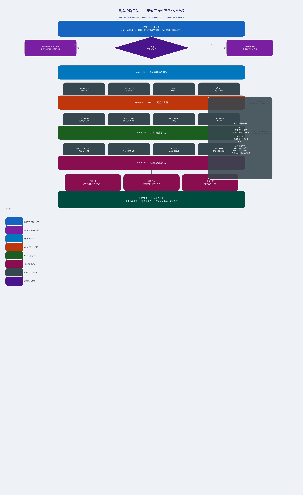

# 異常檢測工站圖像可行性評估工具

本專案提供兩個核心工具：
1. **圖像可行性評估分析框架** — 使用客觀指標與演算法，系統化評估新工站圖像是否適合訓練異常檢測模型
2. **GroundingDINO 自訂數據集評估腳本** — 針對任意 COCO 格式自訂數據集計算物件偵測指標（mAP、AR 等）

---

## 工站圖像可行性評估分析流程

### 背景與痛點

開發人員在評估新工站時，傳統上依賴**人工經驗**判斷以下問題：

- 規格文檔中提到的異常項目，在圖像中是否足夠明顯？
- 缺陷能否在圖像中被捕捉到（虛焊在某些工站圖片中與正常焊點看起來相同）？
- OK 與 NG 圖像能否通過人眼看出明顯差異？
- 圖像是否適合用於目標檢測 / 分割 / 分類模型？

這些問題**缺乏客觀量化指標**，評估結果因人而異。

---

### 常見工站情境

| 工站類型 | 檢測目標 | 特殊挑戰 |
|----------|----------|----------|
| **焊接工站** | 焊點偏位、虛焊、假焊 | 虛焊與正常焊點紋理差異極小，肉眼難辨 |
| **點膠工站** | 膠路完整性、膠寬、異物 | 膠路斷點可能尺寸極小 |
| **外觀檢測工站** | 碰傷、刮傷、壓傷、髒污 | 多種背景環境，異常極小且對比低 |

> **ROI 複雜性**：有些工站需先用目標檢測器 Crop 出元件，再對元件做第二階段異常檢測；有些工站則直接對全圖做極小異常偵測。

---

### 系統化分析流程



> 執行 `python generate_workflow_diagram.py` 可重新產生流程圖。

---

### 各階段說明與對應方法

#### Phase 1 — 數據接收

接收工程人員提供的 OK/NG 圖像與規格文檔，解析異常類型說明、ROI 範圍定義與判斷標準。

---

#### Phase 2 — ROI 判斷與提取

**痛點**：不一定整張圖像都是 ROI，需先確認感興趣區域。

| 情境 | 處理方式 |
|------|----------|
| 整張圖為 ROI | 直接進入後續分析 |
| 局部區域為 ROI | 使用 **GroundingDINO** 文字引導偵測，或 **SAM**（Segment Anything）自動分割裁切 |

```bash
# 使用 GroundingDINO 將文字描述轉換為 ROI 邊界框
# ex: "焊點區域" → 自動 crop 出所有焊點
```

---

#### Phase 3 — 圖像品質基礎評估

**目的**：排除因拍攝條件導致的低品質圖像。

| 指標 | 演算法 | 說明 |
|------|--------|------|
| 模糊程度 | **Laplacian 方差** | 數值低 → 圖像模糊，無法捕捉細節異常 |
| 亮度 / 對比度 | 直方圖分析 | 過曝或欠曝會掩蓋缺陷紋理 |
| 解析度 | ROI 像素尺寸統計 | ROI 過小（< 32px）會使模型難以學習 |
| 標注品質 | 類別平衡性分析 | 嚴重不平衡可能導致模型偏向多數類 |

---

#### Phase 4 — OK / NG 可分性分析

**目的**：客觀量化 OK 與 NG 圖像在特徵空間中的距離，評估是否具備可學習的差異。

| 演算法 | 用途 | 解讀 |
|--------|------|------|
| **CLIP / ResNet 特徵提取** | 將圖像映射到高維嵌入空間 | 提取語意層面的視覺特徵 |
| **t-SNE / UMAP 可視化** | 降維後觀察 OK/NG 群集分布 | 群集分離 → 可分性高；重疊 → 困難 |
| **Fisher 判別比（FDR）** | 類間距離 / 類內距離 | FDR 高 → 特徵可區分，建議用分類模型 |
| **Mahalanobis 距離** | 考慮特徵協方差的距離度量 | 識別離群 NG 樣本 |

```python
# FDR 計算概念
FDR = (mean_OK - mean_NG)^2 / (var_OK + var_NG)
# FDR > 1.0 → 通常表示特徵具有良好可分性
```

---

#### Phase 5 — 異常可見性評估

**目的**：量化 NG 圖像中缺陷的「客觀可見程度」，解決人工判斷主觀性問題。

| 演算法 | 用途 | 適用缺陷類型 |
|--------|------|-------------|
| **LBP（局部二值模式）** | 紋理模式差異量化 | 虛焊、表面紋理異常 |
| **GLCM（灰度共生矩陣）** | 紋理統計特徵（能量、對比、熵） | 材質均勻性異常 |
| **Gabor 濾波器** | 特定方向與頻率的紋理響應 | 刮傷（具有方向性的紋理） |
| **SSIM（結構相似度）** | OK vs NG 結構差異量化 | 形狀變形、壓傷 |
| **FFT 頻域分析** | 異常在頻率空間的訊號強度 | 週期性缺陷、週期性紋理破壞 |
| **PatchCore（無監督）** | 僅使用 OK 圖像訓練，對 NG 給出異常評分 | 所有類型，尤其是難以標注的細微異常 |

```
SSIM 接近 0  → OK 與 NG 結構差異大 → 異常明顯，適合分割/檢測
PatchCore Score 高  → 異常偏離正常分布遠 → 模型有機會學習到此缺陷
```

---

#### Phase 6 — 任務適配性評估

根據前幾個階段的結果，評估最適合的模型任務類型：

| 任務 | 適合條件 | 推薦模型 |
|------|----------|----------|
| **目標檢測** | 異常位置可定位、尺寸 > 8×8px | YOLO、DINO、GroundingDINO |
| **語意分割** | 異常邊緣清晰、形狀具辨識性 | SAM、Mask R-CNN |
| **影像分類** | 全局特徵具區分性（FDR 高）、無需定位 | ResNet、EfficientNet、CLIP |
| **無監督異常檢測** | NG 樣本極少或標注困難 | PatchCore、FastFlow、SimpleNet |

---

#### Phase 7 — 評估報告輸出

產出包含以下內容的評估報告：
- **量化指標摘要**（各階段指標數值）
- **可視化圖表**（t-SNE、SSIM 熱力圖、頻譜圖、Anomaly Score 分布）
- **模型選型建議**（依據客觀指標給出推薦任務與架構）
- **標注策略建議**（是否需要 ROI 預裁切、標注粒度建議）

---

### 流程圖重新產生

```bash
python generate_workflow_diagram.py
# 輸出：evaluation_workflow.png
```

---

## 目錄

- [環境安裝](#環境安裝)
- [數據集架構](#數據集架構)
- [Annotation JSON 格式說明](#annotation-json-格式說明)
- [數據集處理流程](#數據集處理流程)
- [使用方式](#使用方式)
- [參數說明](#參數說明)
- [輸出結果說明](#輸出結果說明)
- [常見問題](#常見問題)

---

## 環境安裝

### 1. 安裝 GroundingDINO

```bash
# 從原始碼安裝（推薦）
git clone https://github.com/IDEA-Research/GroundingDINO.git
cd GroundingDINO
pip install -e .
```

### 2. 安裝其他依賴

```bash
pip install pycocotools torch torchvision
```

### 3. 下載模型權重與設定檔

```bash
# 以 Swin-T 版本為例
mkdir -p weights
wget -P weights/ https://github.com/IDEA-Research/GroundingDINO/releases/download/v0.1.0-alpha/groundingdino_swint_ogc.pth

# 設定檔位於 GroundingDINO/groundingdino/config/
# GroundingDINO_SwinT_OGC.py   → 對應 Swin-T 權重
# GroundingDINO_SwinB_cfg.py   → 對應 Swin-B 權重
```

---

## 數據集架構

本腳本使用 **COCO 格式**作為標準輸入，建議按照以下目錄結構組織資料：

```
my_dataset/
├── images/
│   ├── train/
│   │   ├── img_001.jpg
│   │   ├── img_002.jpg
│   │   └── ...
│   └── val/
│       ├── img_101.jpg
│       ├── img_102.jpg
│       └── ...
└── annotations/
    ├── instances_train.json
    └── instances_val.json
```

> **注意：** 評估時通常只使用 `val` 集，`anno_path` 指向 `instances_val.json`，`image_dir` 指向對應的圖片資料夾。

---

## Annotation JSON 格式說明

標注檔案必須符合 COCO JSON 格式，包含以下三個必要欄位：

### 基本結構

```json
{
  "info": { ... },
  "categories": [ ... ],
  "images": [ ... ],
  "annotations": [ ... ]
}
```

### `categories`（類別定義）

每筆記錄需包含 `id` 與 `name`，類別 ID 從 1 開始（不需要連續）：

```json
"categories": [
  { "id": 1, "name": "helmet" },
  { "id": 2, "name": "vest" },
  { "id": 3, "name": "person" }
]
```

### `images`（圖片資訊）

```json
"images": [
  {
    "id": 1,
    "file_name": "img_001.jpg",
    "width": 1920,
    "height": 1080
  },
  {
    "id": 2,
    "file_name": "img_002.jpg",
    "width": 1280,
    "height": 720
  }
]
```

### `annotations`（標注框）

每個標注框需包含以下欄位，`bbox` 格式為 **[x, y, width, height]**（左上角座標 + 寬高）：

```json
"annotations": [
  {
    "id": 1,
    "image_id": 1,
    "category_id": 1,
    "bbox": [120, 80, 60, 90],
    "area": 5400,
    "iscrowd": 0
  },
  {
    "id": 2,
    "image_id": 1,
    "category_id": 2,
    "bbox": [300, 150, 80, 120],
    "area": 9600,
    "iscrowd": 0
  }
]
```

| 欄位 | 說明 |
|------|------|
| `id` | 標注的唯一識別碼 |
| `image_id` | 對應 `images` 中的圖片 ID |
| `category_id` | 對應 `categories` 中的類別 ID |
| `bbox` | 邊界框，格式為 `[x_min, y_min, width, height]` |
| `area` | 邊界框面積（= width × height），用於區分 small/medium/large |
| `iscrowd` | 是否為群體標注，評估時通常設為 `0` |

---

## 數據集處理流程

腳本內部對數據集的處理步驟如下：

### 1. 讀取標注檔

使用 `pycocotools` 的 COCO API 載入 JSON，並自動建立圖片 ID 索引。

### 2. 座標格式轉換

COCO 標注的 `bbox` 為 **xywh** 格式，腳本會自動轉換為 **xyxy** 格式以供模型使用：

```
[x_min, y_min, w, h]  →  [x_min, y_min, x_min+w, y_min+h]
```

座標同時會被裁剪至圖片邊界範圍內（clamp）。

### 3. 過濾無效標注框

寬度或高度為 0 的退化邊界框（degenerate boxes）會被自動過濾排除。

### 4. 影像前處理

每張圖片依序套用以下轉換：

| 步驟 | 說明 |
|------|------|
| RandomResize | 長邊縮放至 800px，最大尺寸 1333px |
| ToTensor | 轉換為 PyTorch Tensor，像素值縮放至 [0, 1] |
| Normalize | 以 ImageNet 均值/標準差正規化 |

### 5. 類別文字 Prompt 生成

腳本自動將所有類別名稱組合成 GroundingDINO 所需的文字輸入：

```
"helmet . vest . person ."
```

也可透過 `--custom_text` 參數手動指定 prompt。

### 6. 類別映射建立（動態 id_map）

與原始 COCO 腳本不同，本腳本動態從 JSON 的 `categories` 欄位建立 token 映射，支援任意類別 ID 與數量。

---

## 使用方式

### 基本用法

```bash
python evaluate_custom_dataset.py \
    --config_file groundingdino/config/GroundingDINO_SwinT_OGC.py \
    --checkpoint_path weights/groundingdino_swint_ogc.pth \
    --anno_path my_dataset/annotations/instances_val.json \
    --image_dir my_dataset/images/val/
```

### 儲存評估結果至 JSON

```bash
python evaluate_custom_dataset.py \
    --config_file groundingdino/config/GroundingDINO_SwinT_OGC.py \
    --checkpoint_path weights/groundingdino_swint_ogc.pth \
    --anno_path my_dataset/annotations/instances_val.json \
    --image_dir my_dataset/images/val/ \
    --output results/eval_results.json
```

### 自訂文字 Prompt

當類別名稱組合後效果不佳，或需要更精確的描述時，可手動指定：

```bash
python evaluate_custom_dataset.py \
    ... \
    --custom_text "construction helmet . safety vest . worker ."
```

> **格式規則：** 類別之間以 ` . `（空格 + 點 + 空格）分隔，結尾加 ` .`

### 過濾低信心度預測（輸出 JSON 時使用）

```bash
python evaluate_custom_dataset.py \
    ... \
    --output results.json \
    --score_threshold 0.3
```

### 使用 CPU 執行（無 GPU 環境）

```bash
python evaluate_custom_dataset.py \
    ... \
    --device cpu \
    --num_workers 0
```

---

## 參數說明

### 模型相關

| 參數 | 必填 | 預設值 | 說明 |
|------|:----:|--------|------|
| `--config_file` / `-c` | ✅ | — | GroundingDINO 設定檔路徑（`.py` 檔） |
| `--checkpoint_path` / `-p` | ✅ | — | 模型權重檔路徑（`.pth` 檔） |
| `--device` | | `cuda` | 執行裝置，可設為 `cuda` 或 `cpu` |

### 數據集相關

| 參數 | 必填 | 預設值 | 說明 |
|------|:----:|--------|------|
| `--anno_path` | ✅ | — | COCO 格式標注 JSON 檔案路徑 |
| `--image_dir` | ✅ | — | 圖片根目錄路徑 |
| `--num_workers` | | `4` | DataLoader 的工作程序數量 |

### 推論相關

| 參數 | 必填 | 預設值 | 說明 |
|------|:----:|--------|------|
| `--num_select` | | `300` | 每張圖片保留的 Top-K 預測數量 |
| `--score_threshold` | | `0.0` | 儲存至 JSON 的最低信心分數門檻 |
| `--custom_text` | | 自動生成 | 手動指定文字 prompt，覆蓋自動生成的類別描述 |

### 輸出相關

| 參數 | 必填 | 預設值 | 說明 |
|------|:----:|--------|------|
| `--output` / `-o` | | 不輸出 | 將評估指標與預測結果儲存為 JSON 檔案的路徑 |

---

## 輸出結果說明

### 終端機輸出

推論完成後會顯示 12 項標準 COCO 指標：

```
==================================================
  Evaluation Results (bbox)
==================================================
  AP@[IoU=0.50:0.95]                      : 0.4523
  AP@[IoU=0.50]                           : 0.6812
  AP@[IoU=0.75]                           : 0.4901
  AP@[IoU=0.50:0.95] area=small           : 0.2134
  AP@[IoU=0.50:0.95] area=medium          : 0.4876
  AP@[IoU=0.50:0.95] area=large           : 0.6201
  AR@[IoU=0.50:0.95] maxDets=1            : 0.3412
  AR@[IoU=0.50:0.95] maxDets=10           : 0.5023
  AR@[IoU=0.50:0.95] maxDets=100          : 0.5234
  AR@[IoU=0.50:0.95] area=small           : 0.2891
  AR@[IoU=0.50:0.95] area=medium          : 0.5412
  AR@[IoU=0.50:0.95] area=large           : 0.6743
==================================================
```

### JSON 輸出格式（使用 `--output` 時）

```json
{
  "config": {
    "config_file": "...",
    "checkpoint_path": "...",
    "anno_path": "...",
    "image_dir": "...",
    "num_select": 300,
    "score_threshold": 0.3,
    "custom_text": null
  },
  "caption": "helmet . vest . person .",
  "categories": [
    { "id": 1, "name": "helmet" },
    { "id": 2, "name": "vest" }
  ],
  "stats": {
    "AP@[IoU=0.50:0.95]": 0.4523,
    "AP@[IoU=0.50]": 0.6812,
    "...": "..."
  },
  "num_predictions": 1842,
  "predictions": [
    {
      "image_id": 1,
      "category_id": 1,
      "bbox": [120.5, 80.2, 60.1, 90.3],
      "score": 0.872
    }
  ]
}
```

> `predictions` 中的 `bbox` 格式為 COCO 標準的 **[x_min, y_min, width, height]**。

---

## 常見問題

**Q：我的類別 ID 不是從 1 開始，腳本能正常運作嗎？**

A：可以。腳本會動態從 `categories` 欄位讀取 ID，支援任意起始值與非連續 ID（例如 `[1, 5, 10, 42]`）。

---

**Q：類別名稱包含中文或特殊字元會有問題嗎？**

A：GroundingDINO 的文字編碼器（BERT-based）主要針對英文訓練，建議類別名稱使用英文以取得最佳效果。若需使用中文，可嘗試指定 `--custom_text` 並觀察結果。

---

**Q：執行時出現 CUDA out of memory 錯誤怎麼辦？**

A：可嘗試以下方式：
- 降低 `--num_select`（例如改為 `100`）
- 改用 `--device cpu`
- 若使用多 GPU，確認 CUDA_VISIBLE_DEVICES 設定正確

---

**Q：如何確認我的 JSON 格式是否正確？**

A：可使用 `pycocotools` 快速驗證：

```python
from pycocotools.coco import COCO
coco = COCO("my_dataset/annotations/instances_val.json")
print(f"圖片數量: {len(coco.imgs)}")
print(f"類別數量: {len(coco.cats)}")
print(f"標注數量: {len(coco.anns)}")
```

---


通常開發人員在評估一個新的工站是否可以做異常檢測模型的任務時，數據會由工程人員提供: OK\NG數據與規格文檔，文檔中可能會說明圖片中的哪個部分需要檢測甚麼異常...等之類的，對於異常項的說明。收到數據之後，開發人員會評估在文檔中寫到的異常項目在圖像中是否足夠明顯?缺陷是否可以在圖像中呈現(虛焊在不分工站圖片中的焊點會有紋理上的差異、有些看起來是跟正常焊點一樣)?OK跟NG圖像是否通過人眼可以看出明顯差異?這些圖像能不能應用於目標檢測\分割\分類模型?

會主要以這些點做考量，但可以發現一個問題就是基本都是靠人工和經驗去判斷，沒有使用任何模型或是算法能給出這些問題一個客觀的指標，我可以使用甚麼模型或是算法去解決我那些評估的點?

在這些對圖片內容進行指標計算之前還有一個痛點就是，我可能有幾種不同的情景:
1. 焊接工站，檢測焊點偏位，焊點本身有沒有須焊...等
2. 點膠工站，檢測膠路、膠寬、異物...等
3. 檢測工站，在許多不同的背景之下，檢測難以捕捉的異常，像是: 碰傷、刮傷、壓傷、髒污...2/3

**Q：`area` 欄位一定要填嗎？**

A：是的，`area` 欄位用於 COCO 評估時區分 small（< 32²）、medium（32²–96²）、large（> 96²）物件的 AP/AR，缺少此欄位會導致 `pycocotools` 報錯。計算方式為 `area = bbox[2] * bbox[3]`（寬 × 高）。
